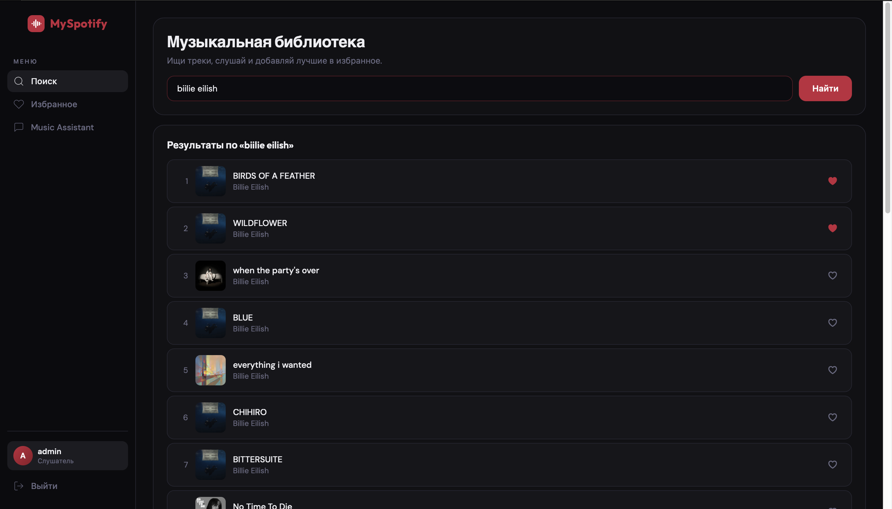
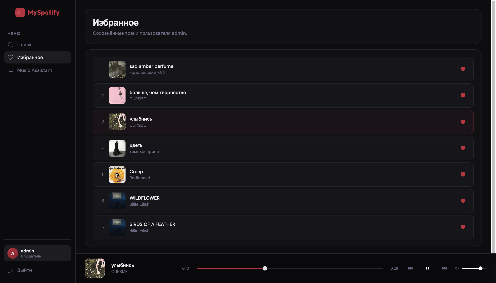
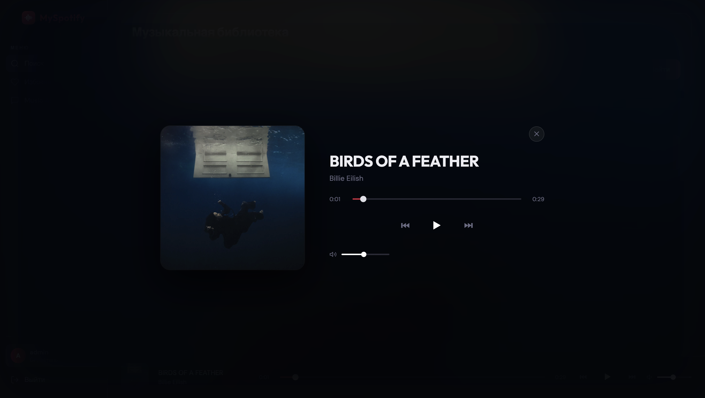
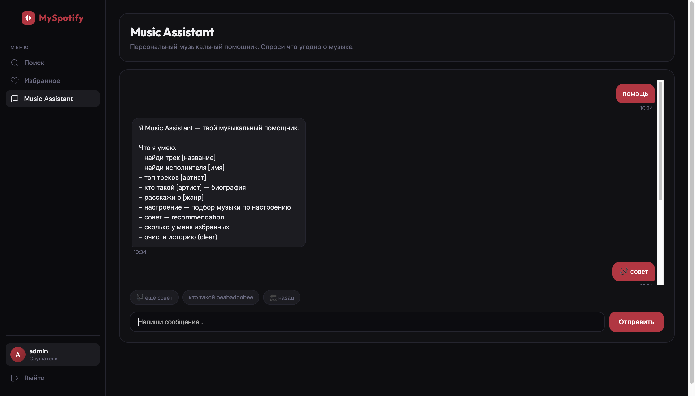
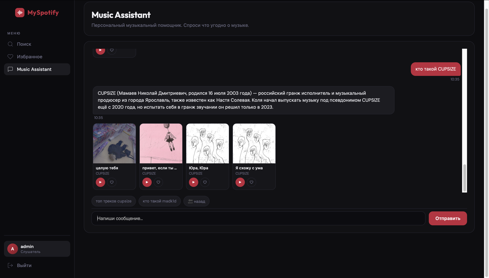

# MySpotify — Music Chatbot Web Application

> **Author:** Khapiz Akezhan  
> **Discipline:** Programming in Python  
> **Stack:** Python 3.14.2 · Django · SQLite · Deezer API · Last.fm API

---

## 📌 Project Description

**MySpotify** is a full-featured music web application built with Django. At its core is **Music Assistant** — an intelligent chatbot that helps users discover music, search for tracks and artists, get personalized recommendations, and explore music by mood.

Users can register, log in, search for songs via the Deezer API, add tracks to their favorites, and chat with the music bot which supports 15+ command types and maintains a full conversation history per user.

---

## 🛠️ Technologies Used

| Technology | Purpose |
|---|---|
| Python 3.14.2 | Core language |
| Django 6.x | Web framework (MVC, ORM, Auth) |
| SQLite | Database (messages, songs, users) |
| Deezer API | Track search and audio preview |
| Last.fm API | Artist biographies and metadata |
| HTML / CSS / JavaScript | Frontend UI |
| `requests` library | HTTP calls to external APIs |

---

## 📁 Project Structure

```
myspotify/
├── manage.py
├── requirements.txt
├── README.md
├── myspotify/
│   ├── settings.py
│   ├── urls.py
│   ├── wsgi.py
│   └── asgi.py
└── music/
    ├── models.py          # Song, ChatMessage models
    ├── views.py           # All page and API views
    ├── music_bot.py       # Chatbot logic (15+ intents)
    ├── services.py        # Last.fm service helper
    ├── admin.py
    ├── urls.py (via myspotify/urls.py)
    ├── migrations/
    ├── templates/
    │   └── music/
    │       ├── base.html
    │       ├── index.html      # Search page
    │       ├── favorites.html  # Favorites page
    │       ├── chat.html       # Chatbot page
    │       ├── login.html
    │       └── register.html
    └── static/
        └── music/
            └── style.css
```

---

## ⚙️ Installation

### 1. Clone the repository

```bash
git clone https://github.com/wmn5xhndff-dev/MySpotify.git
cd myspotify
```

### 2. Create and activate a virtual environment

```bash
python -m venv .venv

# Windows
.venv\Scripts\activate

# macOS / Linux
source .venv/bin/activate
```

### 3. Install dependencies

```bash
pip install -r requirements.txt
```

### 4. Apply database migrations

```bash
python manage.py migrate
```

### 5. (Optional) Create an admin superuser

```bash
python manage.py createsuperuser
```

---

## ▶️ Running the Application

```bash
python manage.py runserver
```

Then open your browser and go to:

```
http://127.0.0.1:8000/
```

---

## 💬 Chatbot — Examples of Use

The chatbot is available at `/chat/`. Below are supported commands:

| User Input | Bot Response |
|---|---|
| `привет` | Greeting with the user's name |
| `помощь` | Full list of available commands |
| `найди трек Blinding Lights` | Searches Deezer and returns track cards with preview |
| `найди исполнителя Drake` | Returns top tracks by the artist |
| `топ треков Eminem` | Shows Eminem's most popular tracks |
| `кто такой The Weeknd` | Artist biography from Last.fm |
| `🎭 настроение` | Opens mood selector (sad / workout / romantic / relax...) |
| `😭 грустно` | Plays sad tracks (XXXTentacion style) |
| `🚀 тренировка` | Plays high-energy phonk tracks |
| `совет` | Gives a personalized track recommendation |
| `расскажи о джаз` | Genre overview + related tracks |
| `сколько у меня избранных` | Shows count of saved favorites (requires login) |
| `очисти историю` | Clears the chat history |
| `пока` | Goodbye message |
| Unknown input | Fallback: searches Deezer and suggests commands |

---

## 🗄️ Data Storage

- **Songs** — stored in `Song` model (title, artist, Deezer ID, preview URL, cover, per-user favorites)
- **Chat history** — stored in `ChatMessage` model (role: user/bot, content, timestamp, user FK)
- **Sessions** — anonymous users have chat history stored in Django sessions
- **Database** — SQLite (`db.sqlite3`), auto-created on first `migrate`

---

## 🔐 Authentication

- Register at `/register/`
- Login at `/login/`
- Logout at `/logout/`
- Favorites and chat history are **per-user** and isolated from other accounts

---

## 🌐 API Integrations

**Deezer API** (no key required)
- Search endpoint: `https://api.deezer.com/search?q=...`
- Returns track title, artist, album cover, 30-second preview URL

**Last.fm API**
- Used for artist biography (`artist.getInfo`)
- API Key is configured in `music/services.py` and `music/music_bot.py`

---

## 🖼️ Screenshots

> 
> 
> 
> 
> 

---

## ✅ Error Handling

The application handles the following error cases:

- Empty user input in chat → returns error prompt
- Unknown chatbot command → fallback search + help suggestion
- Deezer API timeout or failure → returns empty result gracefully
- Last.fm API failure → skips biography, shows tracks only
- Track has no preview URL → shows "no preview" state in player
- Unauthenticated access to favorites → shows login prompt

---

## 📋 Requirements

See `requirements.txt` for the full list. Main dependencies:

```
django
requests
```
